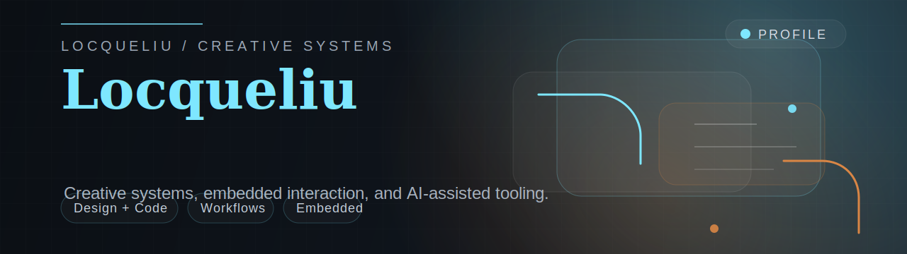

# Hi, I'm Locqueliu

[Chinese Version](./README_zh.md)

I build across creative tooling, AI-assisted visual systems, embedded interaction, and workflow-heavy personal software.

Most of the things I care about sit somewhere between design and engineering: desktop tools, AIGC production systems, interaction experiments, and projects that connect software logic with real devices.

## Featured repositories

- [AiTnt](https://github.com/locqueliu/AiTnt) - local desktop workspace for AI image, video, assets, and workflows
- [esp32-agent-control-demo](https://github.com/locqueliu/esp32-agent-control-demo) - MCP-style control chain for AI-agent-driven ESP32 interaction
- [creative-portfolio-starter](https://github.com/locqueliu/creative-portfolio-starter) - poster-led portfolio structure for visual, motion, 3D, and AI-heavy work
- [aigc-visual-workflows](https://github.com/locqueliu/aigc-visual-workflows) - structured AIGC workflow notes for prompts, nodes, QA, and reusable output
- [xiaozhi-esp32-selfhost-playbook](https://github.com/locqueliu/xiaozhi-esp32-selfhost-playbook) - self-host routing notes for xiaozhi-esp32 deployments and fallback handling
- [stm32-desk-pet-extension-playbook](https://github.com/locqueliu/stm32-desk-pet-extension-playbook) - STM32 desk pet extension notes, module breakdowns, and interaction paths

## What I like building

- visual workflow tooling
- AI-assisted production systems
- desktop software with a clear working rhythm
- interaction-heavy prototypes
- embedded experiments with strong feedback loops

## Outside of code

- motion and edit experiments
- visual concept development
- 3D and scene-based design thinking
- systems that help creative work move faster

## Links

- Bilibili: [space.bilibili.com/442741846](https://space.bilibili.com/442741846)
- Email: [locqueliu@outlook.com](mailto:locqueliu@outlook.com)

## Note

Some client work and exploratory branches stay private, so the repositories here mostly focus on the tools, workflows, and engineering patterns I can keep evolving in public.
