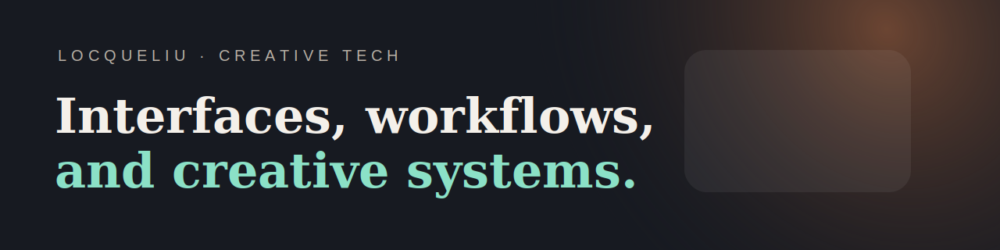

# 你好，我是 Locqueliu

[English Version](./README.md)

我平时做的东西大多卡在设计和工程中间。

有的是桌面工具，有的是 AIGC 视觉流程，有的是嵌入式交互，也有一些是把软件逻辑往真实设备上接的实验。比起单纯做一个“功能”，我更喜欢把一整套使用过程理顺，让它真的能接着用、接着长。

## 这里比较值得先看的仓库

- [AiTnt](https://github.com/locqueliu/AiTnt) - 我自己在打磨的本地桌面 AI 创作工作站
- [esp32-agent-control-demo](https://github.com/locqueliu/esp32-agent-control-demo) - 我整理的 AI Agent 控制 ESP32 的一条控制链路
- [creative-portfolio-starter](https://github.com/locqueliu/creative-portfolio-starter) - 我自己会拿来改作品集的一套页面结构
- [aigc-visual-workflows](https://github.com/locqueliu/aigc-visual-workflows) - 我在整理的 AIGC 工作流记录
- [xiaozhi-esp32-selfhost-playbook](https://github.com/locqueliu/xiaozhi-esp32-selfhost-playbook) - 我记 xiaozhi 自托管部署思路的地方
- [stm32-desk-pet-extension-playbook](https://github.com/locqueliu/stm32-desk-pet-extension-playbook) - 我整理 STM32 桌宠扩展思路和结构拆解的地方

## 我比较喜欢做的方向

- 视觉工作流工具
- AI 辅助生产系统
- 有明显使用节奏感的桌面软件
- 交互比重比较高的原型
- 能看到直接反馈的嵌入式实验

## 代码之外

- 动态剪辑和后期实验
- 视觉概念推演
- 3D 和场景化设计
- 帮创作流程提速的系统整理

## 链接

- Bilibili: [space.bilibili.com/442741846](https://space.bilibili.com/442741846)
- 邮箱: [locqueliu@outlook.com](mailto:locqueliu@outlook.com)

## 说明

有些客户项目和还在折腾中的分支不会公开，所以这里能看到的，基本都是我愿意长期往下做、也适合持续放出来的部分。
